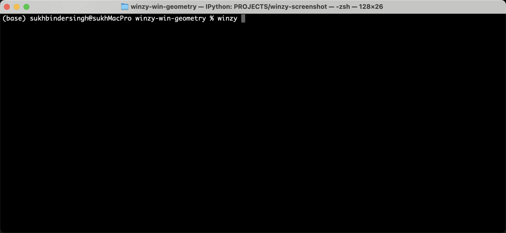

# winzy-win-geometry

[](https://pypi.org/project/winzy-win-geometry/)
[](https://github.com/sukhbinder/winzy-win-geometry/releases)
[](https://github.com/sukhbinder/winzy-win-geometry/actions?query=workflow%3ATest)
[](https://github.com/sukhbinder/winzy-win-geometry/blob/main/LICENSE)

Get window geometry as a percentage of screen size.

## Installation

First configure your Winzy project [to use Winzy](https://github.com/sukhbinder/winzy).

Then install this plugin in the same environment as your Winzy application.
```bash
pip install winzy-win-geometry
```
## Usage

Usage is 

```bash
winzy wingeo -t "Terminal"
```




## Development

To set up this plugin locally, first checkout the code. Then create a new virtual environment:
```bash
cd winzy-win-geometry
python -m venv venv
source venv/bin/activate
```
Now install the dependencies and test dependencies:
```bash
pip install -e '.[test]'
```
To run the tests:
```bash
python -m pytest
```
